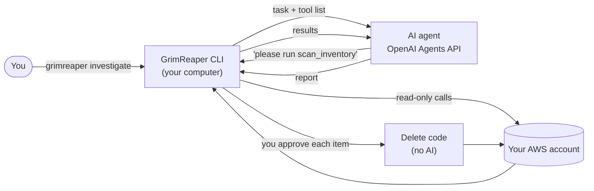

# GrimReaper

**Find out what's quietly costing you money on AWS, why, and what's safe to remove.**

GrimReaper is an AI agent that reads your Amazon Web Services (AWS) bill, looks at everything running in your
account, and explains in plain English which things are costing money for nothing. It never deletes anything
on its own: you approve every removal.

> New to AWS or AI agents? Start with **[How GrimReaper works](docs/how-it-works.md)**, which explains
> every idea from scratch with no prior knowledge needed.

---

## Why this exists

I was being charged by AWS every day and couldn't tell why. The bill said things like `Global-WebACLV2` and
`USE2-EBS:SnapshotUsage`, which meant nothing to me. Finding the cause took hours of clicking through regions and
services. It turned out to be leftovers from old experiments:

- a security filter (a "WAF rule") attached to a website setup I had already switched off
- copies of server images sitting in two regions I never use
- a domain setup for a test website

None of it was doing anything, and all of it was billing me. GrimReaper is the tool I wish I'd had that day.

## What it does

Think of it as a careful accountant who reads your bill *and* walks through your house to find what's still
switched on.

1. **Reads the bill.** Where is the money going? What's charging *right now*? What's new or rising?
2. **Takes inventory.** Lists everything in your account that can cost money, in every region of the world.
3. **Checks for signs of life.** Is that server actually used, or idle for two weeks? Was that resource
   deleted already, and the bill just hasn't caught up?
4. **Explains and recommends.** Matches each charge to the thing causing it, and marks each thing
   **delete**, **review**, or **keep**, with the evidence.

Then **you** decide. GrimReaper only removes what you approve, one item at a time.

### What a report looks like

From a real run on my account, the day after I cleaned it up by hand:

> The last 3 days show $0.88 in WAF and snapshot charges, but these sources are already stopped: CloudTrail
> records DeleteWebACL and DeleteSnapshot events on October 1. Cost Explorer lags 24–48 hours; these are not
> additional savings available now.

| Action | Resource | Why |
|---|---|---|
| review | Elastic IP `54.85.183.48` | Unattached, but created today. Its recent creation doesn't prove it's abandoned. |
| review | 1 GiB disk `grimreaper-test` | Unattached, no activity data yet. Confirm the test is finished before deleting. |
| keep | S3 bucket `do-not-delete-ssm-…` | Protected by its name. |

## What it will never do

- **The AI can't delete anything.** It only has tools that *read*. Removal is done by separate, plain code that
  runs only after you type `y` for each item.
- **It can't make things up.** Every resource it mentions must come from the real inventory. Anything else is
  thrown away before you see it.
- **Your AWS keys stay on your computer.** The AI asks questions; your computer answers them. See
  [how that works](docs/how-it-works.md#the-conversation-between-the-agent-and-your-computer).
- **Protected things stay protected.** Anything tagged `grimreaper:keep` or `do-not-delete`, named
  `do-not-delete`, or managed by CloudFormation is never removed.

---

## Try it

You need Python 3.10+, an AWS profile, and an OpenAI API key with Agents API access
(`api.agents.read`, `api.agents.write`, `api.responses.write`).

```bash
pip install -e .
export OPENAI_API_KEY=sk-...

grimreaper scan --profile myprofile             # no AI: the bill + everything that can cost money
grimreaper investigate --profile myprofile      # the agent explains it -> .grimreaper/report.json
grimreaper reap --profile myprofile             # dry run: shows what would be deleted
grimreaper reap --profile myprofile --execute   # deletes, asking you before each item
grimreaper watch --profile myprofile            # daily mode: only wakes the agent when something changed
grimreaper report --redact                      # show the last report again, with account IDs hidden
```

Add `--redact` to any command to hide AWS account IDs, which is handy for screenshots.

`scan`, `investigate`, and `watch` only need read access (`ReadOnlyAccess` plus `ce:GetCostAndUsage`).
Use a separate profile with more permissions for `reap --execute`.

### Run it every day

[`.github/workflows/watch.yml`](.github/workflows/watch.yml) runs `grimreaper watch` each morning on GitHub
Actions. Quiet days make no AI call at all. When something new starts costing money, the agent explains it,
posts to Slack if you set `SLACK_WEBHOOK_URL`, and the run fails so GitHub emails you. It's off until you set the
repository variable `GRIMREAPER_WATCH=true` and add the secrets listed at the top of the file.

### Docker

```bash
docker build -t grimreaper .
docker run --rm -it -v ~/.aws:/home/reaper/.aws -e OPENAI_API_KEY -e AWS_PROFILE=myprofile grimreaper scan
```

## How it's built



| Part | File | What it does |
|---|---|---|
| Inventory | `scanners.py` | Lists billable resources in every region, with rough monthly costs |
| Bill | `costs.py` | Cost Explorer queries, credits excluded, with "new / rising / stopped" detection |
| Signs of life | `utilization.py` | 14 days of CloudWatch usage per resource |
| History | `trail.py` | CloudTrail create/delete events, which explain charges that outlive their resources |
| Agent | `agent.py` | The agent's instructions, its six read-only tools, and the report format |
| Agent runtime | `runtime.py` | Runs an Agents API session and answers its tool requests locally |
| Removal | `reaper.py` | One plain delete function per resource type, refuses anything protected |
| Daily mode | `watch.py` | Compares today with yesterday; wakes the agent only on changes |

**Why one agent, not a team of agents?** I first built a "crew" of agents working in parallel. In testing, the
Agents API's built-in subagents couldn't use tools that run on *your* computer (OpenAI's docs confirm:
"Subagents do not support function tools"), and keeping AWS access local mattered more than the extra agents.
One focused agent with a clear checklist does the job.

## Project status

- **Tested automatically:** 22 tests, with AWS simulated by [moto](https://github.com/getmoto/moto) and the
  Agents API simulated by a fake session. No account or key needed: `pip install -e ".[dev]" && pytest`.
- **Tested live** on a real AWS account: `scan`, the agent's investigation, and the delete code for Elastic IPs,
  EBS volumes and snapshots (used to clean up the test resources).
- **Not yet tested live:** the interactive `reap --execute` prompt, delete code for the other resource types,
  the Docker image, and the daily GitHub workflow.

## License

MIT
