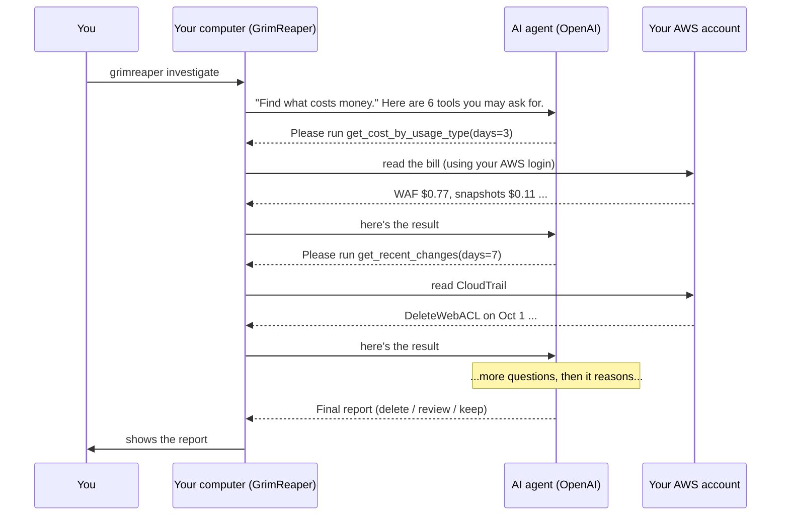
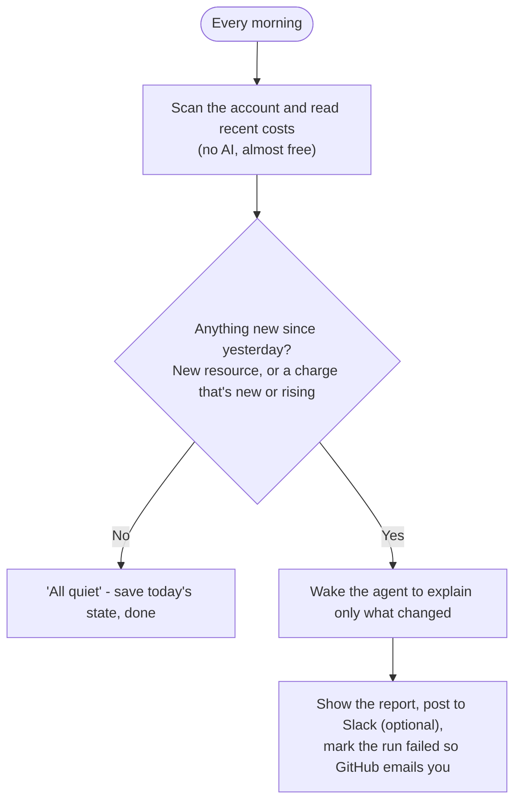

# How GrimReaper works

This page explains GrimReaper from the ground up. You don't need to know AWS, AI agents, or programming.
Each idea builds on the one before it.

- [1. The problem: cloud bills are hard to read](#1-the-problem-cloud-bills-are-hard-to-read)
- [2. The words you'll see](#2-the-words-youll-see)
- [3. What an "AI agent" is](#3-what-an-ai-agent-is)
- [4. The conversation between the agent and your computer](#the-conversation-between-the-agent-and-your-computer)
- [5. One run, step by step](#5-one-run-step-by-step)
- [6. The safety rules](#6-the-safety-rules)
- [7. Daily mode](#7-daily-mode)
- [8. What it costs to run](#8-what-it-costs-to-run)

---

## 1. The problem: cloud bills are hard to read

When you use AWS (Amazon Web Services), you rent computers, storage, and networking by the hour or by the
gigabyte. It's like a utility bill, except:

- **Things keep billing until you remove them.** Switching something "off" isn't always enough; a stopped
  server's disk still costs money.
- **Things are spread around the world.** AWS has about 30 *regions* (Virginia, Ohio, Sydney, …). Something
  forgotten in Sydney doesn't show up when you look at Virginia.
- **The bill uses internal codes.** A line like `USE2-EBS:SnapshotUsage` means "backup copies of disks, stored
  in Ohio." Nothing tells you *which* copies.
- **The bill is late.** Charges show up 1–2 days after they happen, so the bill can still show something you
  deleted yesterday.

So answering "what is costing me money, and can I delete it?" means connecting three sources by hand: the
bill, the list of things that exist, and the history of what was created or deleted. That connecting work
is what GrimReaper does.

## 2. The words you'll see

| Word | Plain meaning |
|---|---|
| **Region** | A location where AWS runs data centres, like `us-east-1` (Virginia) or `ap-southeast-2` (Sydney). |
| **EC2 instance** | A rented virtual computer (a server). |
| **EBS volume** | A virtual hard disk. It can be attached to a server or sit around unattached, still billing. |
| **Snapshot** | A backup copy of a disk. Cheap individually, but they pile up. |
| **AMI** | A saved "image" of a whole server, used to create new ones. It's backed by snapshots. |
| **Elastic IP** | A fixed public internet address. AWS charges for it, especially when it's not attached to anything. |
| **Load balancer / NAT gateway** | Networking pieces that cost money every hour they exist, even with no traffic. |
| **WAF** | A security filter for websites. Billed monthly per rule set. |
| **S3 bucket** | A storage folder for files. |
| **Cost Explorer** | AWS's tool for asking questions about your bill. |
| **CloudWatch** | AWS's measurements: CPU use, number of requests, bytes sent. It shows whether something is *used*. |
| **CloudTrail** | AWS's history log: who created or deleted what, and when. |
| **Credits** | Promotional money AWS gives you. GrimReaper ignores them, so you see what you'd really pay. |

## 3. What an "AI agent" is

A regular AI chat answers from what it already knows. An **agent** can also *use tools*: it decides it needs
information, asks for it, reads the answer, and decides what to do next. It keeps going until it has what it
needs.

GrimReaper's agent has six tools, and all of them only *read*:

| Tool | Question it answers |
|---|---|
| `get_cost_by_service` | Which services cost the most over the last 30 days? |
| `get_cost_by_usage_type` | What exactly is billing in the last few days? |
| `compare_cost_windows` | What's new, rising, or stopped compared with the days before? |
| `get_recent_changes` | What was created or deleted recently? (CloudTrail) |
| `scan_inventory` | What exists in the account, in every region? |
| `check_utilization` | Is this specific thing actually being used? (CloudWatch) |

Why use AI at all, if the tools do the reading? Because the hard part is **judgment**: noticing that a $0.77
WAF charge belongs to something deleted yesterday, or that an unattached disk created an hour ago is probably
not abandoned. That reasoning is what the agent adds. Everything else is ordinary code.

The agent runs on OpenAI's **Agents API**, a service released in 2026 for running agents. It takes care of
the AI side: running the model, keeping track of the conversation, and pausing when the agent wants a tool.

## The conversation between the agent and your computer

This is the most important design choice in GrimReaper. The AI runs on OpenAI's servers, but your AWS
access stays on your computer. They talk like this:

Each time the agent wants information, its session **pauses** and says "please run this tool." GrimReaper
runs the tool on your computer, with your AWS login, and sends back only the *result*. Your AWS keys are never
sent to OpenAI. The results are, though: OpenAI sees things like resource names and costs, so don't run it on an
account whose resource names are themselves secret.

## 5. One run, step by step

1. **You start it:** `grimreaper investigate`.
2. **The agent gets its checklist:** money first, then history, then resources, then reconcile (match each
   charge to its cause).
3. **It reads the bill:** totals by service, what's billing in the last 3 days, what's new or rising.
4. **It reads the history:** what was deleted (to explain charges that outlive their resources) and what was
   created recently (to avoid flagging brand-new things as abandoned).
5. **It takes inventory:** every billable resource in every region, each with a rough monthly cost.
6. **It checks for signs of life:** for servers, disks, load balancers and databases, 14 days of usage data.
7. **It reconciles and writes a report:** a summary, plus a verdict for each resource:
   - **delete**: abandoned or idle, with evidence, and not protected
   - **review**: might be in use, or the evidence is mixed
   - **keep**: protected, in use, or free
8. **GrimReaper double-checks the report:** any resource the agent mentions that the inventory didn't actually
   find is removed. This stops the AI from inventing things.
9. **You decide:** `grimreaper reap` shows what *would* be deleted. `grimreaper reap --execute` asks you about
   each item, one at a time.

## 6. The safety rules

| Rule | How it's enforced |
|---|---|
| The AI can't delete | The agent is only given read tools. Delete code lives in a separate file (`reaper.py`) that only the command line calls. |
| You approve each deletion | `reap` is a dry run by default. With `--execute`, it asks "Reap it?" for every item. |
| No invented resources | Verdicts that don't match a real inventory item are dropped (`validate` in `agent.py`). |
| Protected things stay | Tags `grimreaper:keep` / `do-not-delete`, names containing `do-not-delete`, and CloudFormation-managed resources are refused by the delete code itself. |
| Risky types are report-only | Kubernetes clusters (EKS), shared file systems (EFS), database clusters, and live CloudFront distributions are never deleted automatically. |
| No secrets in errors | If a tool fails, the agent sees the AWS error code (like `AccessDenied`), never internal details. |

## 7. Daily mode

`grimreaper watch` is meant to run every morning, for example on GitHub Actions.

Most days nothing changes, so most days cost nothing in AI usage.

## 8. What it costs to run

- **AWS:** Cost Explorer charges $0.01 per query. A full investigation makes a handful, so a few cents.
  The inventory, CloudWatch and CloudTrail reads used here are free or close to it.
- **OpenAI:** each investigation is one agent session with a dozen or so tool calls. The cost depends on the
  model and is shown in your OpenAI usage dashboard.
- **Daily mode:** quiet days make no AI call.
